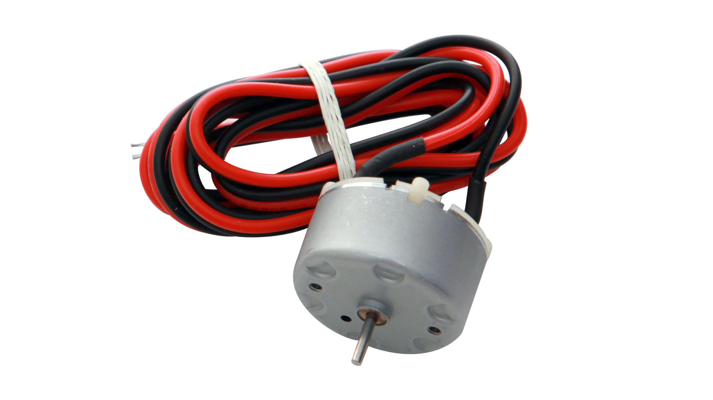

# KidWind 
## Resources

- [KidWind Rules](https://kidwind.org/challenges/rules/)
- KidWind Gears - official ([Thingiverse](https://www.thingiverse.com/thing:3612652)) ([local copy](./assets/KidWind Gears.zip){:download})
- [KidWind Advanced Blade Design Manual](./assets/KidWind Advanced Blade Design Manual.pdf){:download}
															
## Generator

[Vernier KidWind Wind Turbine Generator with Wires](https://www.vernier.com/product/kidwind-wind-turbine-generator-with-wires/)
										 
- Mass: 41.6 g
- Rated Voltage: DC 5.9 V
- Rated Load: 10.0 g-cm
- At no load:
	- Speed = 2000 RPM
	- Current = 0.011 A
- At stall:
	- Torque = 40 g-cm
	- Current = 0.147 A
- At maximum efficiency:
     - Efficiency = 60.851%
     - Speed = 1569 RPM
     - Torque = 8.6 g-cm
     - Current = 0.040 A
     - Power = 0.144 W
- At maximum output:
     - Speed = 999 RPM
     - Torque = 20 g-cm
     - Current = 0.079 A
     - Power = 0.214 W
