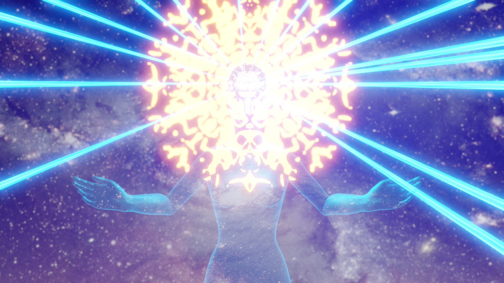

# Bell Work Rubric

| **Criteria**              | **Emerging** | **Developing** |  **Proficient** | **Distinguished** |
|---------------------------|----------------------|----------------------|----------------------|----------------------|
| **Creativity & Innovation** | Response lacks creativity and does not explore new ideas. | Response shows some creativity but lacks depth or originality. | Response is creative and presents a solid, well-considered idea. | Response demonstrates original, imaginative thinking with a unique and thought-provoking perspective. |
| **Engineering & Problem-Solving Approach** | Little to no application of engineering or problem-solving principles. | Some attempt at engineering or logical reasoning, but the solution is underdeveloped. | Uses engineering or problem-solving concepts effectively, but the approach could be more detailed. | Clearly applies engineering principles or logical problem-solving strategies to develop a well-reasoned solution. |
| **Clarity & Organization** | Response is difficult to understand or lacks logical flow. | Response is somewhat unclear or lacks organization in parts. | Response is mostly clear and organized but may have minor lapses in structure. | Response is clearly written, well-structured, and easy to follow. Ideas flow logically. |
| **Depth & Justification** | Response lacks justification or explanation. | Response provides minimal explanation or lacks sufficient support. | Response includes reasoning and justification, but some aspects could be expanded. | Response provides detailed reasoning and strong justification for the proposed solution. |
| **Engagement with the Prompt** | Shows little engagement with the question; response is superficial or incomplete. | Partially engages with the question but does not fully explore its implications. | Engages with the question and presents a reasonable response. | Fully engages with the question, exploring its implications and offering insightful ideas. |

Image credits: [Jon Manning](https://secretlab.institute/2021/02/15/cc-0-licensed-galaxy-brain-images/)