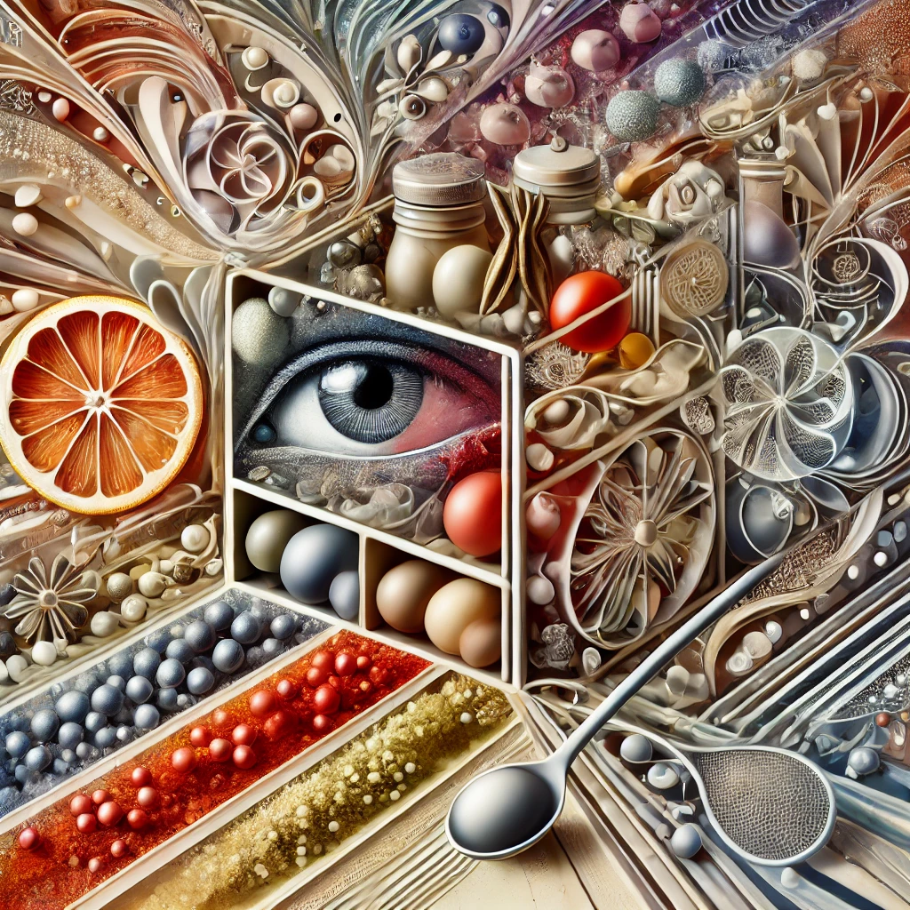

# Bell Work 010

!!! info
    Bell Work is an opportunity to develop your creative thinking and written communication skills. You can either answer the question, or describe how you would approach answering the question. There are no wrong answers! Grading is based on:
    
    - Creativity & Innovation
    - Engineering & Problem-Solving Approach
    - Clarity & Organization
    - Depth & Justification
    - Engagement with the Prompt
    
    See the [rubric](000 Bell Work Rubric.md) for details.

!!! question
    How would you design a spice rack for a blind person?

!!! warning
    This assignment is **Level 1** on the [AI Acceptable Usage Scale](../AI Acceptable Usage Scale.md).

The abstract illustration accompanying this prompt was generated using OpenAI’s ChatGPT-4 and DALL·E 3. The image was designed to conceptually represent the engineering-related question in an abstract and thought-provoking manner.
