# Pygame Zero: Nice Bike!

Before we're done, you'll draw this bicycle on the screen out of nothing but
straight lines and circles. There's no `draw_bicycle()` function — there's you,
some coordinates, and a bit of geometry. First we need a window, some color, and
a way to place shapes exactly where we want them.

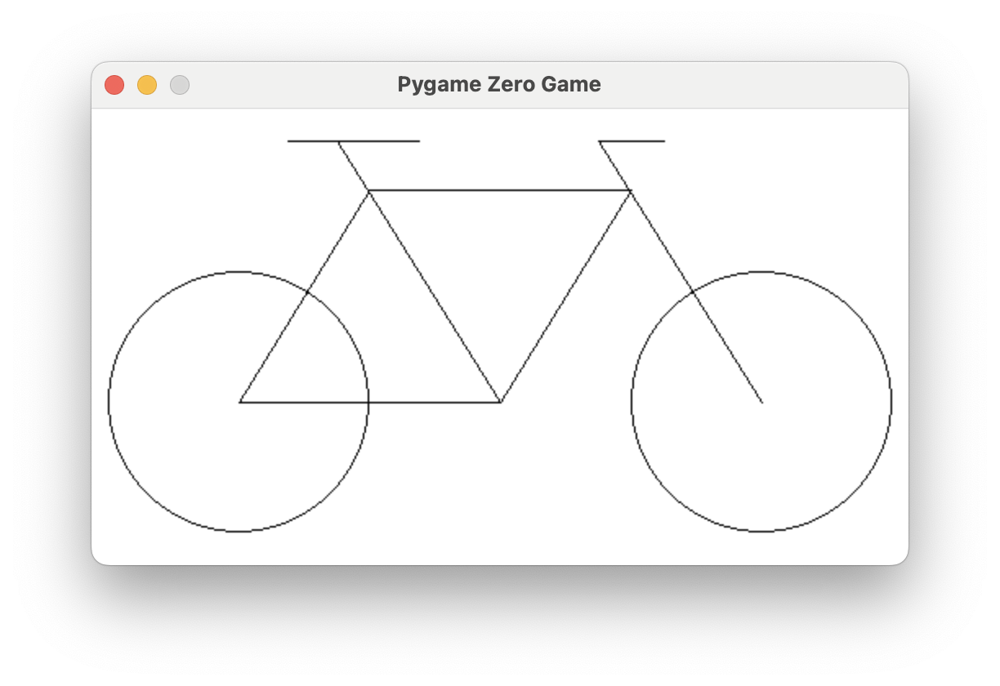{ width="420" }

---

## Overview

In this lab you'll open a Pygame Zero window, learn how colors are built from
red, green, and blue, and use the drawing functions for lines and circles. Then
you'll put it all together to reproduce a bicycle from a set of coordinates.

**Builds on:** the Python basics you practiced with [*Meet Reeborg!*](../reeborg-10-meet-reeborg/index.md) — setting variables and calling functions.

!!! note "Before you start"
    Open your Pygame Zero editor and start a new program named `bike.py`.

!!! abstract "You've got it when…"
    - [x] A window opens at the size your `WIDTH` and `HEIGHT` set.
    - [x] You can fill the background with a color, by RGB numbers *or* by name.
    - [x] Your bicycle matches the target — both wheels, the frame, the seat, and the handlebar in the right places.

!!! info "Collaboration & AI"
    **Work:** On your own. Ask a neighbor if you get stuck, but the program you submit should be yours.

    **AI — AIAS Level 1, No AI:** This lab is about learning to place shapes with coordinates yourself, so set AI aside for this one. [What the levels mean.](https://aiassessmentscale.com/)

---

## Create a Window

Start with two **variables**, `WIDTH` and `HEIGHT`. Pygame Zero uses these
special variables to set the size of the window.

```python title="bike.py"
WIDTH = 300
HEIGHT = 300
```

Try it out. Your screen should look like this.

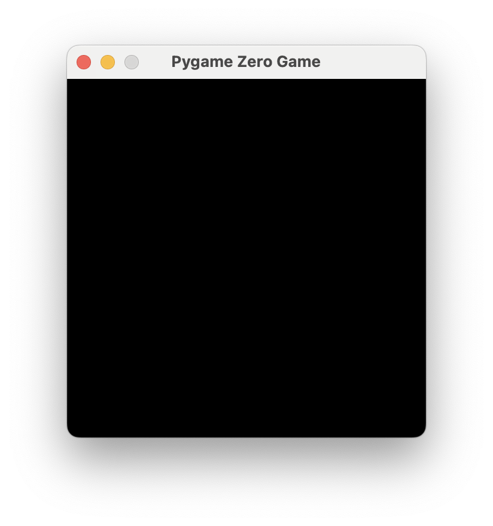{ width="360" }

Now make the window larger.

```python
WIDTH = 800
HEIGHT = 600
```

!!! warning
    If your window doesn't change size, check that the variables `WIDTH` and
    `HEIGHT` are spelled *exactly* as shown here.

---

## Colors

### Mixing Colors

Try this.

```python
WIDTH = 800
HEIGHT = 600
BGCOLOR = (135, 206, 250)

def draw():
    screen.fill(BGCOLOR)
```

Your screen should look like this.

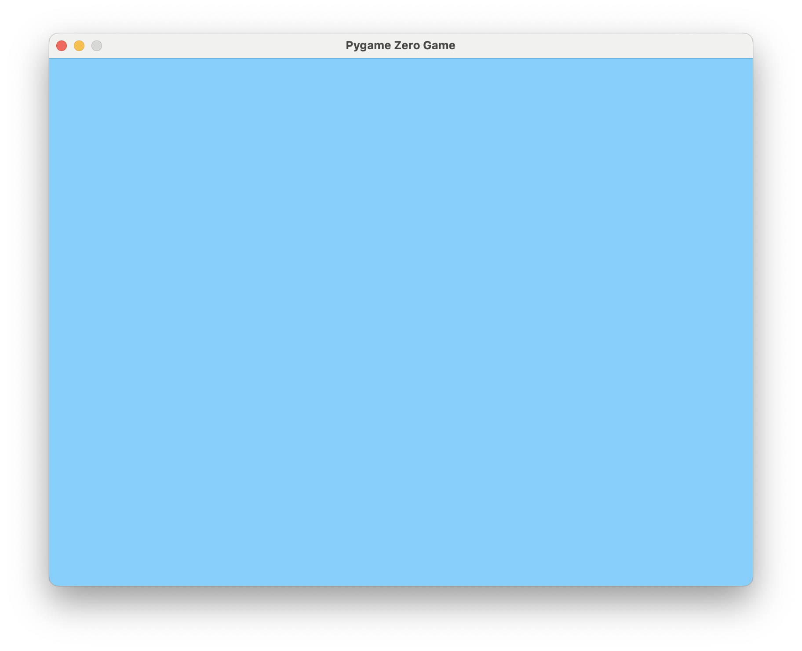{ width="420" }

What do the numbers in `(135, 206, 250)` mean? In computer graphics, a color is
usually three numbers giving a mix of red, green, and blue, or **RGB**. Each
value runs from `0` to `255` and says how much of that channel to add.

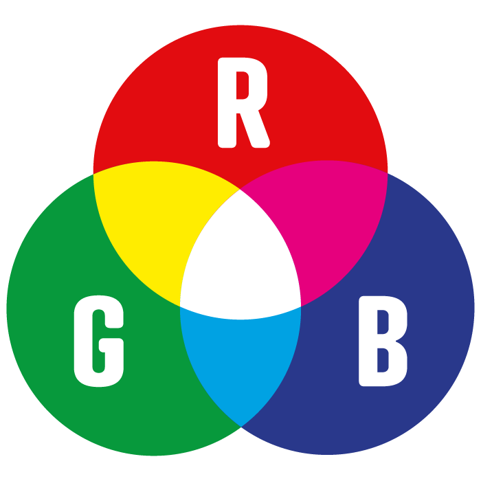{ width="320" }

!!! info "Why 0 to 255?"
    Remember binary numbers. Each color gets one **byte** — eight bits — to say
    how much to mix. The largest value eight bits can hold is `11111111` in
    binary, which is `255` in decimal. That's the ceiling for red, green, and
    blue.

Try the [color picker here](https://rgbcolorpicker.com/) and blend some custom
colors.

### Named Colors

You can also use names for many colors instead of RGB numbers. Try changing the
`BGCOLOR` variable like this:

```python
BGCOLOR = "skyblue"
```

!!! warning
    Notice that the color name `"skyblue"` is in **double quotes**. This tells
    Python the value is a **string** — a piece of text.

---

## Drawing

### The `draw()` Function

Everything drawn inside your window happens inside a special function named
`draw`. We used it above to set the background color with `screen.fill()`.

### 2D Graphics Coordinates

2D graphics usually put the **origin** `(0, 0)` at the **upper-left** pixel. The
**x-axis** increases from left to right, and the **y-axis** increases from top
to bottom.

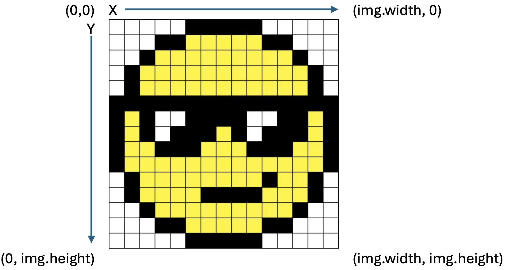{ width="480" }

!!! info
    This is different from Scratch, where the origin sits in the *center* of the
    screen. In Pygame Zero it's the upper-left corner.

### Lines and Circles

Try this.

```python
WIDTH = 800
HEIGHT = 600

def draw():
    screen.fill("skyblue")
    screen.draw.circle((250, 250), 50, "white")
    screen.draw.filled_circle((250, 100), 50, "red")
    screen.draw.line((150, 20), (150, 450), "purple")
    screen.draw.line((150, 20), (350, 20), "purple")
```

Notice that **x/y coordinates** are given inside their own parentheses. These
are the functions you'll use to draw:

| Function | What it does | Example |
| --- | --- | --- |
| `screen.draw.line(start, end, color)` | Draws a line from `start` to `end`. `start` and `end` are x/y coordinates; `color` is an RGB tuple or a name. | `screen.draw.line((150, 20), (150, 450), "purple")` |
| `screen.draw.circle(pos, radius, color)` | Draws the *outline* of a circle centered at `pos`. `radius` is half the diameter. | `screen.draw.circle((250, 250), 50, "white")` |
| `screen.draw.filled_circle(pos, radius, color)` | Same as `circle`, but filled with the color instead of just an outline. | `screen.draw.filled_circle((250, 100), 50, "red")` |

---

## Challenge: Draw a Bicycle

Reproduce the bicycle drawing below **precisely**.

!!! warning
    Read **all** of the hints and tips below before you begin.

{ width="420" }

### Hints and Tips

1.  Here is the bicycle on a grid. Each grid square is 10 x 10. You do not need
    to draw the grid.

    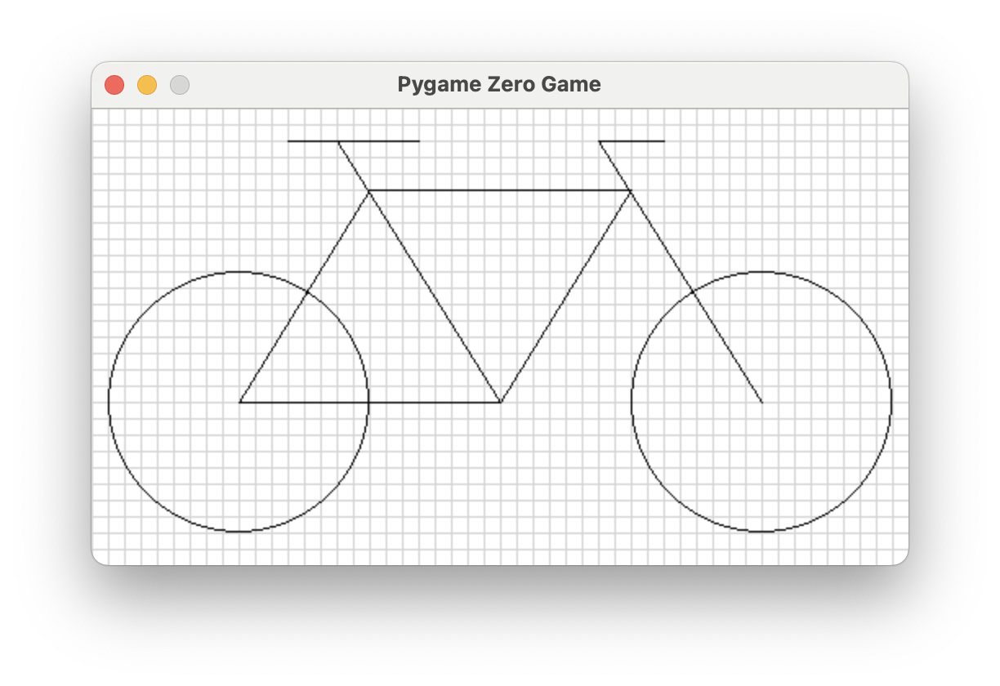{ width="420" }

2.  The screen is 500 wide and 280 high.
3.  The rear wheel is centered at `(90, 180)`; the front wheel at `(410, 180)`.
    Both wheels have a radius of `80`.
4.  The frame (shown in red) connects `(170, 50)`, `(330, 50)`, `(250, 180)`,
    and the center of the rear wheel.

    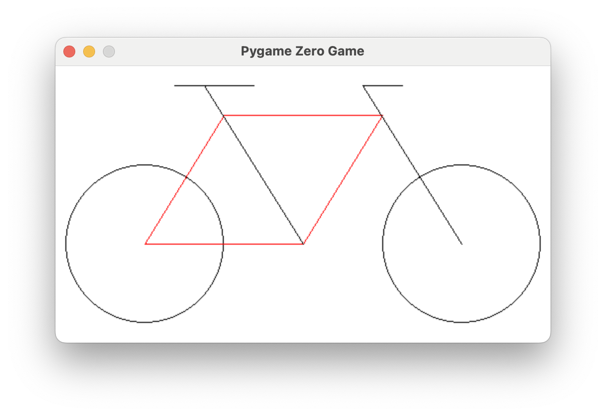{ width="420" }

5.  The seat tube (in red) connects one of the lower frame points to `(150, 20)`.

    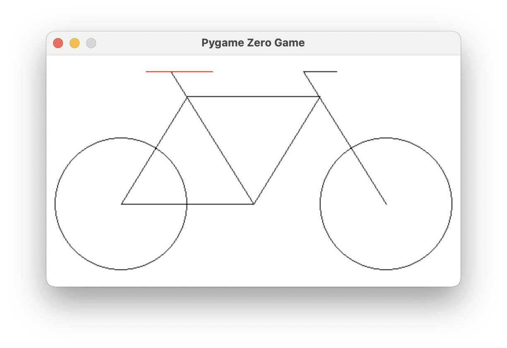{ width="420" }

6.  The steering tube (in red) connects the center of the front wheel to
    `(310, 20)`.

    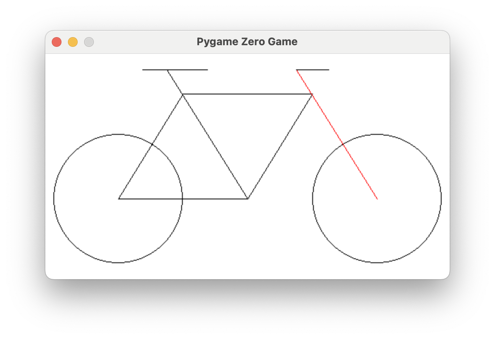{ width="420" }

7.  The handlebar (in red) is `40` long.

    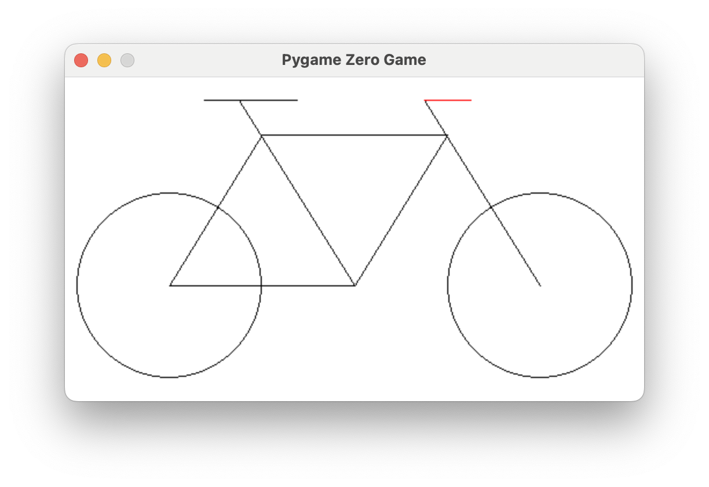{ width="420" }

8.  The seat (in red) is `80` long, with the x-coordinate of its rear end at
    `120`.

    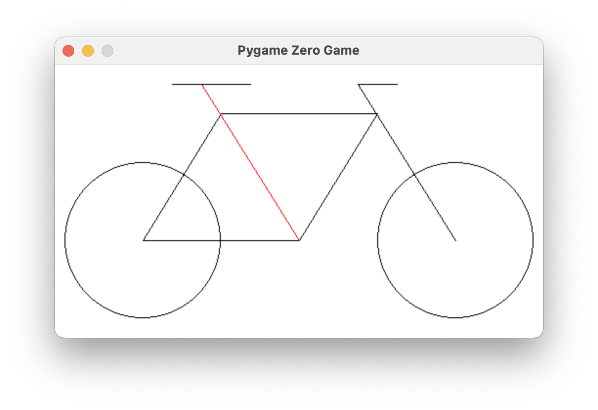{ width="420" }

### Bonus

Draw a crank and pedal with any design you like. In the example, the crank hides
part of the frame behind it but still has a red outline — done with **two**
circles: a white filled circle, then a red outline circle on top of it.

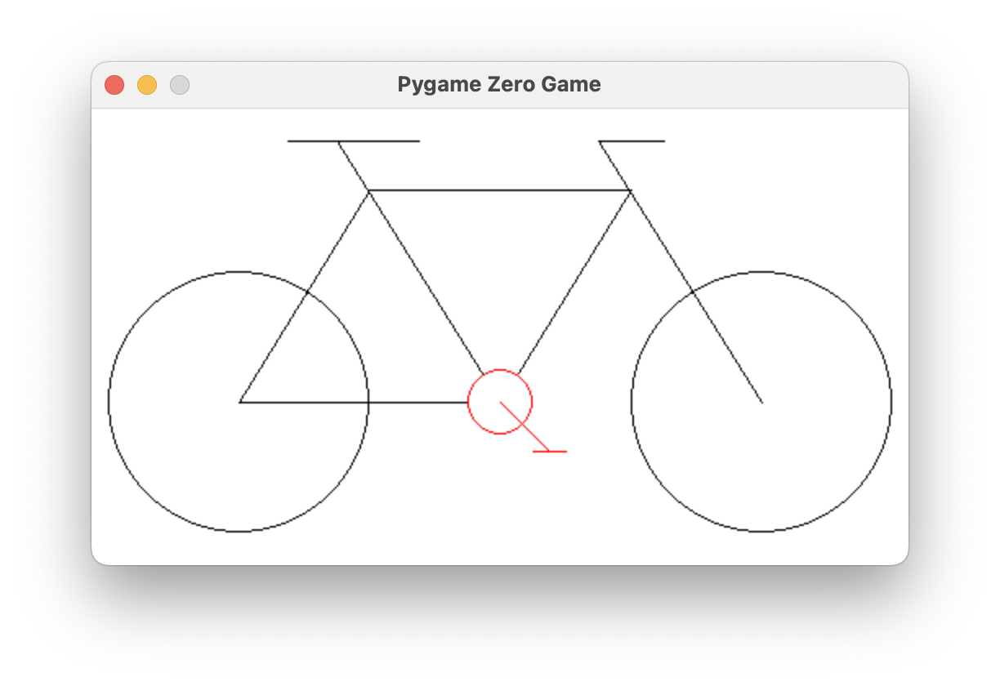{ width="420" }

---

## Turn It In

- [ ] Submit your `bike.py` file with your program to draw the bicycle.
